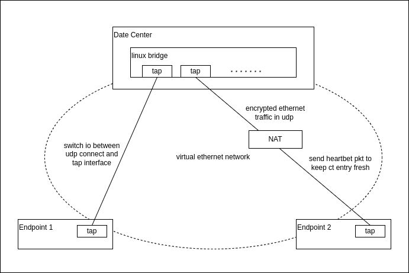
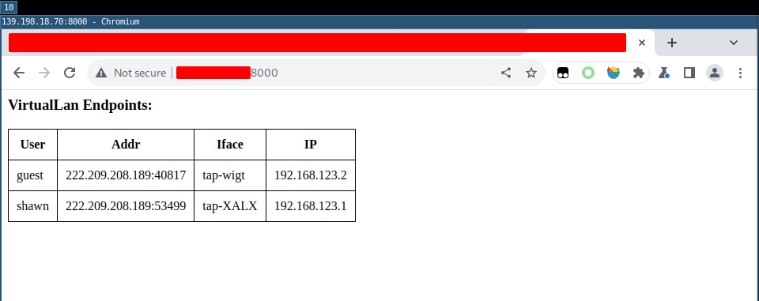

# virtuallan
## Description
virtuallan is a l2vpn. It can setup an virtual Ethernet LAN network in WAN.

## Features
* Basic auth for vpn endpoint
* AES encrypt for ethernet traffic
* Ethernet traffic in udp

## How it work

* server create a linux bridge for each virtual ethernet network
* server create a tap interface for each authed endpoint
* client create a tap interface
* encrypt ethernet traffic that on tap interface and send to udp conn
* receive udp stream from conn and decrypt then send to tap interface

An udp connection just like a cable connect dc and ep taps. And the taps became to a pair linux veth peer, connected to a linux bridge.

## Build

```
➜  virtuallan git:(master) ✗ make
go generate pkg/cipher/cipher.go
go build -o virtuallan main.go
```

go generate will generate an random aes key

## Use with docker

**Build**
>IMG=\<your image name>:\<tag> make build-docker

**Run docker image as server**
>docker run --privileged=true -d --restart always -p 6123:6123/udp -p 8000:8000 quay.io/shawnlu0127/virtuallan:20240507

## Getting started

**Server**
```
➜  virtuallan git:(master) ✗ ./virtuallan server -h
NAME:
   virtuallan server - run virtuallan server

USAGE:
   virtuallan server [command options] [arguments...]

OPTIONS:
   --config-dir value, -d value  config directory to launch virtuallan server, conf.yaml as config file, users as user storage
   --help, -h                    show help
```

config dir files:
* config.yaml: server config file
* users: user database csv format \<username>,\<user passwd base64 encode>

**Endpoint**
```
➜  virtuallan git:(master) ✗ ./virtuallan client -h
NAME:
   virtuallan client - connect to virtuallan server

USAGE:
   virtuallan client [command options] [arguments...]

OPTIONS:
   --target value, -t value  socket virtuallan server listened on
   --addr value, -a value    ipv4 address of current endpoint
   --user value, -u value    username of virtuallan endpoint
   --passwd value, -p value  password of virtuallan endpoint user
   --help, -h                show help
```

If not set -u and -p flags, you need to input user name and passwd in console

**User manage**

```
➜  virtuallan git:(master) ✗ ./virtuallan user list  -d ./config/users
shawn,guest
➜  virtuallan git:(master) ✗ ./virtuallan user add -h
NAME:
   virtuallan user add - add user

USAGE:
   virtuallan user add [command options] [arguments...]

OPTIONS:
   --db value, -d value      user db file loaction
   --user value, -u value    username of user
   --passwd value, -p value  password of user
   --help, -h                show help
```

### Try it out

If enable web, it will start a http server on port 8000. Check the endpoints in index page.



Links of virtuallan server
```
root@i-5tb1rpqn:~# ip a show br0
3: br0: <BROADCAST,MULTICAST,UP,LOWER_UP> mtu 1500 qdisc noqueue state UP group default qlen 1000
    link/ether 52:85:8d:51:1f:e0 brd ff:ff:ff:ff:ff:ff
    inet 192.168.123.254/24 brd 192.168.123.255 scope global br0
       valid_lft forever preferred_lft forever
    inet6 fe80::b46f:44ff:fef6:f8a9/64 scope link 
       valid_lft forever preferred_lft forever
root@i-5tb1rpqn:~# ip l show master br0
4: tap-XALX: <BROADCAST,MULTICAST,UP,LOWER_UP> mtu 1500 qdisc fq_codel master br0 state UNKNOWN mode DEFAULT group default qlen 1000
    link/ether 56:f7:9f:01:b9:c6 brd ff:ff:ff:ff:ff:ff
5: tap-wigt: <BROADCAST,MULTICAST,UP,LOWER_UP> mtu 1500 qdisc fq_codel master br0 state UNKNOWN mode DEFAULT group default qlen 1000
    link/ether 62:01:07:45:89:56 brd ff:ff:ff:ff:ff:ff
root@i-5tb1rpqn:~# ping 192.168.123.1 -c 1
PING 192.168.123.1 (192.168.123.1) 56(84) bytes of data.
64 bytes from 192.168.123.1: icmp_seq=1 ttl=64 time=39.5 ms

--- 192.168.123.1 ping statistics ---
1 packets transmitted, 1 received, 0% packet loss, time 0ms
rtt min/avg/max/mdev = 39.514/39.514/39.514/0.000 ms
root@i-5tb1rpqn:~# ping 192.168.123.2 -c 1
PING 192.168.123.2 (192.168.123.2) 56(84) bytes of data.
64 bytes from 192.168.123.2: icmp_seq=1 ttl=64 time=32.7 ms

--- 192.168.123.2 ping statistics ---
1 packets transmitted, 1 received, 0% packet loss, time 0ms
rtt min/avg/max/mdev = 32.719/32.719/32.719/0.000 ms
```

server log
```
root@i-5tb1rpqn:~/tmp# ./main server -d ./config/
INFO[0000] run web server on port 8000                  
WARN[0108] wrong passwd for user shawn                  
INFO[0129] client <remote address of endpoint>:53499 login to shawn succeed 
INFO[0129] client <remote address of endpoint>:53499 auth succeed    
INFO[0299] client <remote address of endpoint>:40817 login to guest succeed 
INFO[0299] client <remote address of endpoint>:40817 auth succeed
```